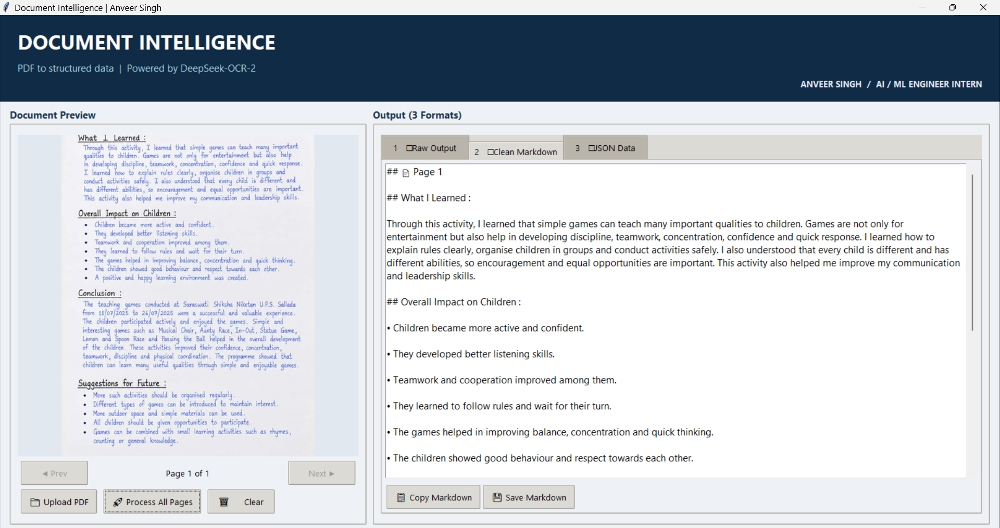
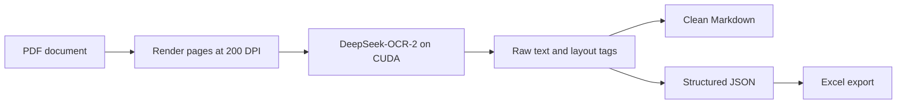

# Document Intelligence with DeepSeek-OCR-2

**ANVEER SINGH | AI / ML ENGINEER INTERN**

A Python desktop application that converts scanned and handwritten PDF pages into readable Markdown and structured JSON, with an Excel export option. It combines local GPU inference with document preview, page navigation, and a practical workflow for inspecting and saving OCR results.



*Actual application screenshot: the handwritten source on the left and extracted Markdown on the right.*

## What this project demonstrates

- **Model integration:** running the pretrained DeepSeek-OCR-2 vision-language model through PyTorch and Hugging Face Transformers.
- **Document preprocessing:** rendering PDF pages to images at 200 DPI with PyMuPDF.
- **Structured extraction:** turning model layout tags into page-level JSON with headings, text items, and table data.
- **Desktop application development:** a Tkinter interface with background model loading and inference, document preview, and three output tabs.
- **Usable outputs:** copy or save raw text, Markdown, and JSON; export structured data to Excel.
- **Reproducible demonstrations:** optional automatic output saving with processing time and inference settings.

This is an application and inference integration project. The pretrained OCR model is developed by DeepSeek; this repository does not claim to train or fine-tune it.

## Handwritten document demo

The supplied **Handwritten School Activity Report Page.pdf** was processed locally on 7 October 2026.

| Item | Observed result |
| --- | --- |
| Input | One handwritten page with headings, paragraphs, and bullet points |
| GPU | NVIDIA GeForce RTX 4050 Laptop GPU, 6 GB VRAM |
| OCR processing time | 91.41 seconds |
| Structured result | 1 page, 4 headings, 14 text entries |
| Headings | What I Learned; Overall Impact on Children; Conclusion; Suggestions for Future |
| Settings | 200 DPI; base size 1024; image size 768; crop mode enabled |

The recorded duration covers page inference, output parsing, and saving during this run. Model loading and PDF rendering are excluded. It is a single observation, not a throughput or accuracy benchmark; performance and memory use vary with hardware and page content.

**Explore the actual files:** [source PDF](examples/school-activity-report/source.pdf) · [Markdown](examples/school-activity-report/extracted.md) · [JSON](examples/school-activity-report/structured.json) · [raw model output](examples/school-activity-report/raw.txt) · [run metadata](examples/school-activity-report/run-metadata.json)

The screenshot was supplied from the running application. OCR exports are preserved as produced by the application, without manual transcription corrections.

## How it works



The GUI sends each page to the model with the prompt `Convert the document to markdown` and grounding enabled. It removes layout markers for the Markdown view and groups recognized text under headings for JSON. Pages are processed sequentially. The image CLI supports a single image input.

## Setup

The demo used **Windows, Python 3.12.0, PyTorch 2.5.1 with CUDA 12.1, and Transformers 4.46.3**. An NVIDIA GPU and a compatible driver are required by the current implementation. CPU-only inference is not implemented.

Open PowerShell in this repository after cloning or extracting it:

```powershell
py -3.12 -m venv .venv
.\.venv\Scripts\python.exe -m pip install --upgrade pip
.\.venv\Scripts\python.exe -m pip install torch==2.5.1 torchvision==0.20.1 --index-url https://download.pytorch.org/whl/cu121
.\.venv\Scripts\python.exe -m pip install -r requirements.txt
.\.venv\Scripts\python.exe download_model.py
.\.venv\Scripts\python.exe -c "import torch; print(torch.cuda.is_available())"
```

The last command should print `True`. Tkinter is included in the standard Windows Python installer. Dependencies are pinned to the versions present during the demo; a clean installation of this package has not yet been independently tested.

**No model files are included in this repository.** The `download_model.py` command downloads weights, tokenizer files, configuration, custom model code, and the upstream license into `models/DeepSeek-OCR-2/`. The entire `models/` directory is ignored by Git.

The demonstrated weight file is approximately **6.78 GB**. Allow additional disk space for Python dependencies and caches. The downloader pins the Hugging Face revision recorded with the local model: `c11b6e95159dad69de5d0efe4931eb822fd7194b`. Internet access is needed for the initial download; the application then loads from the local folder.

Alternatively, download the files from the [model's pinned Hugging Face revision](https://huggingface.co/deepseek-ai/DeepSeek-OCR-2/tree/c11b6e95159dad69de5d0efe4931eb822fd7194b) into `models/DeepSeek-OCR-2/`. Keep the configuration, tokenizer, custom Python files, license, weight index, and all referenced `.safetensors` shards together. Run `python download_model.py --check` to check that the required files are present.

The application uses `trust_remote_code=True` to load DeepSeek's custom model implementation. Review that code before running it. FlashAttention is optional; the app falls back to eager attention if it is unavailable.

## Run

```powershell
.\.venv\Scripts\python.exe ocr_ui.py
```

1. Wait for the model to load.
2. Select **Upload PDF** and choose a document, such as `examples/school-activity-report/source.pdf`.
3. Select **Process All Pages**.
4. Inspect **Raw Output**, **Clean Markdown**, or **JSON Data**.
5. Use the save buttons, or choose **Export Excel** from the JSON tab.

To automatically save the results of each completed processing run:

```powershell
.\.venv\Scripts\python.exe ocr_ui.py --output-dir outputs\my-report
```

This writes `raw.txt`, `extracted.md`, `structured.json`, and `run-metadata.json`. Use a different output directory for each document; another run in the same directory replaces those four files.

For a single image:

```powershell
.\.venv\Scripts\python.exe ocr_final.py "path\to\page.png" "result.json"
```

Check that model files are present without downloading again:

```powershell
.\.venv\Scripts\python.exe download_model.py --check
```

## Repository layout

```text
.
|-- ocr_ui.py                  # PDF desktop interface and exports
|-- ocr_final.py               # Single-image command-line inference
|-- download_model.py          # Download model files separately
|-- requirements.txt           # Application dependencies
|-- docs/screenshots/          # Actual application demo screenshot
`-- examples/school-activity-report/
    |-- source.pdf
    |-- raw.txt
    |-- extracted.md
    |-- structured.json
    `-- run-metadata.json
```

The `models/DeepSeek-OCR-2/` folder is created locally by the downloader and is not part of this repository. Model files, virtual environments, caches, logs, and temporary processing files are excluded from Git. The small example files and screenshot are intentionally included.

## Current limits

- Handwriting, small text, low-quality scans, and complex layouts can produce OCR errors. Review outputs against the source before using them.
- JSON structure is based on the model's layout tags, not a general-purpose semantic understanding of the document. The title uses the first recognized Markdown heading.
- The table parser treats two-column tables as financial label/amount pairs; this assumption does not suit every document.
- The demonstrated input contains no tables. Table extraction, Excel export, and multipage processing are implemented but were not validated by this single-page demo.
- There is no formal word-error-rate or character-error-rate evaluation. The demo confirms a complete run and saved outputs, not a claimed accuracy percentage.
- This is a local desktop prototype with no job queue or cancel control. Model and PDF size affect responsiveness and GPU memory requirements.

## Credits

**Portfolio:** Anveer Singh — AI / ML Engineer Intern.

**Model:** [DeepSeek-OCR-2](https://huggingface.co/deepseek-ai/DeepSeek-OCR-2), by DeepSeek AI. The separately downloaded model is governed by its [upstream license](https://huggingface.co/deepseek-ai/DeepSeek-OCR-2/blob/c11b6e95159dad69de5d0efe4931eb822fd7194b/LICENSE.txt). Third-party components retain their respective licenses.

**Stack:** Python · PyTorch · Transformers · PyMuPDF · Pillow · Tkinter · openpyxl.
